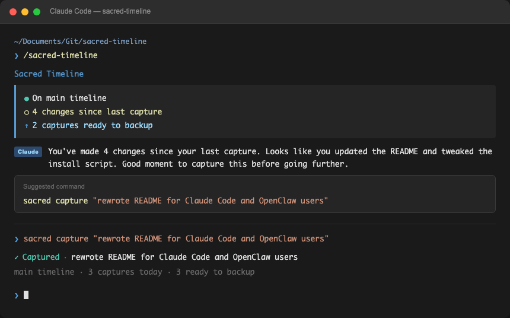

# Sacred Timeline

**Capture your work, protect your progress, travel through time — no coding required.**


---

> *"Safety to experiment is infrastructure, not culture. You can't culture-initiative your way to an experimental organisation. People make rational decisions based on the cost of failure. If that cost is high, they play it safe — regardless of what the culture deck says."*
>
> — [Innovation Architecture: The Infrastructure Nobody Built](https://www.thehelixloop.com/innovation-architecture-the-infrastructure-nobody-built/)

Git solved this for engineers twenty years ago. Sacred Timeline brings the same architecture to everyone building in the AI age — writers, strategists, consultants, vibe coders. Same power, human language.

---

## Built for Claude Code and OpenClaw users



You're building with AI. Claude Code or OpenClaw writes the code, makes the changes, ships the features. You direct. It executes.

But here's the problem nobody warns you about: **AI moves fast and leaves no paper trail.**

An hour of Claude Code sessions can generate hundreds of changes across dozens of files. Then something breaks. Or you want to try a completely different approach. Or you just want to understand what actually happened today.

That's where Sacred Timeline comes in.

**Sacred Timeline is the missing layer between AI-generated work and protected history.** It wraps git in plain English so you capture every meaningful moment — without ever needing to know what git is.

---

## Quickest way to start

Copy this prompt and paste it into Claude Code, OpenClaw, or any AI agent:

```
I want to start using Sacred Timeline to protect and track my work. I don't know git. Before we do anything else, please explain:

1. What Sacred Timeline actually is — in plain English, no jargon
2. Why someone like me would want it
3. What "capture", "backup", and "experiment" mean in practice

Once I understand what I'm getting into, then help me set it up:

- Check if Sacred Timeline is installed: command -v sacred
- If not installed: npm install -g @suhit/sacred-timeline
- Run `sacred status` and tell me what it shows
- If the folder isn't tracked yet, run `sacred start`
- Walk me through my first capture: sacred capture "my message here"
  (plain message in quotes — no -m flag)
- Explain how to back up to GitHub when I'm ready: sacred connect <github-url>

Only use sacred commands throughout. Use simple language — pretend I've never heard of git.

For the deeper idea behind why this exists, share this read: https://www.thehelixloop.com/innovation-architecture-the-infrastructure-nobody-built/
```

Then press Enter — your AI agent takes it from there.

---

## Why Git matters when AI is doing the work

When you code yourself, you naturally remember what you changed. When AI codes for you, that awareness disappears. You end up with:

- A working project you can't explain
- Changes you can't undo if something breaks
- No way to try a bold new approach without risking what you have

Git solves all of this — but it was designed for engineers, not for people building with AI.

Sacred Timeline gives you git's superpowers in language that makes sense:

| When you want to... | Sacred Timeline | What's happening under the hood |
|---------------------|-----------------|----------------------------------|
| Save this moment | `capture` | git commit |
| Try something risky | `experiment` | git branch |
| That worked, keep it | `keep` | git merge |
| That broke, nevermind | `discard` | git branch -d |
| Something's broken, go back | `restore` | git checkout |
| Send to cloud | `backup` | git push |
| Get from cloud | `latest` | git pull |
| What changed? | `changes` | git diff |
| Tell me the story | `narrate` | git log (analyzed) |

---

## How to use it with Claude Code

### One-line install

```bash
curl -fsSL https://raw.githubusercontent.com/suhitanantula/sacred-timeline/main/install.sh | bash
```

Installs the `sacred` CLI and the Claude Code skill automatically.

### In any Claude Code session

Type `/sacred-timeline` at the start of a session. Claude will:
- Check your timeline status
- Speak in sacred language throughout
- Suggest captures at natural milestones
- Wrap up the session with a plain-English story of what was built

No API key needed. Sacred Timeline runs as a Claude Code skill — it's just instructions that travel with every session.

### The daily Claude Code workflow

```
Start session → /sacred-timeline
Build with Claude Code
Reach a milestone → sacred capture "what we built"
Try something risky → sacred experiment "new-approach"
Done for the day → sacred backup
```

---

## How to use it with OpenClaw

The `sacred` CLI works anywhere. In your OpenClaw sessions:

```bash
sacred status          # where am I?
sacred capture "what was built"
sacred experiment "try-this-direction"
sacred backup
```

OpenClaw agents can call these directly. Sacred Timeline becomes the memory layer for every agent session.

---

### Not sure where to start?

**[suhitanantula.github.io/sacred-timeline](https://suhitanantula.github.io/sacred-timeline)** — copy a prompt, paste it into Claude, and Claude walks you through the whole setup.

---

## Quick Start

> **First:** open your terminal and `cd` into the folder you want to protect before running any sacred commands. Sacred Timeline tracks whichever folder you're in.

### New project:
1. `sacred start` — initialise the timeline
2. Do your work (or let AI do it)
3. `sacred capture "what we built"` — freeze this moment
4. `sacred connect <github-url>` — link to cloud (see below)
5. `sacred backup` — send it up

**Getting your GitHub URL:** go to [github.com](https://github.com), create a free account if you don't have one, click **New repository**, give it a name, and copy the URL it shows you (looks like `https://github.com/yourname/yourproject.git`). Paste that into `sacred connect`.

### Daily workflow:
1. `sacred latest` — get any changes
2. Work (or build with AI)
3. `sacred capture "milestone description"` at natural stopping points
4. `sacred backup` when done

### Trying something risky:
1. `sacred experiment "name-it"`
2. Make the bold changes freely
3. It worked → `sacred keep`
4. It didn't → `sacred discard` — main timeline untouched

---

## The Origin Story

Watching Marvel's **Loki**, something clicked.

The TVA protects the Sacred Timeline — the one true, proven version of reality. Variants create branch timelines to explore dangerous, divergent possibilities. If a branch succeeds, it gets woven back in. If it fails, it gets pruned. No harm done to the Sacred Timeline.

**That's exactly how git works.**

Main branch = Sacred Timeline. Feature branches = alternate realities for safe experimentation. Commits = nexus events that freeze a moment in time.

The problem: git speaks in commands designed for engineers. But the *concepts* — safe experimentation, protected history, mergeable parallel realities — belong to everyone building anything in the AI age.

So we built the human interface for it.

> *"Your world may seem singular to you, but really, it's a teeny, tiny, weenie speck on a vast cosmic canvas. In reality, the only universe considered the true universe exists on the Sacred Timeline, and it is guarded zealously by all of us here at the TVA."*
>
> —Mr. Paradox to Deadpool


*The Sacred Timeline from Marvel's Loki (©2021 Marvel). The red thread is your main branch — protected, proven, untouchable.*

---

## Who This Is For

- **Claude Code users** — building fast with AI, needing protection and history without slowing down
- **OpenClaw users** — wanting a memory layer across agent sessions
- **Vibe coders** — using Cursor, Windsurf, or any AI tool without knowing git exists
- **Writers** managing manuscripts, research, long-form work
- **Consultants and strategists** building frameworks and documents iteratively
- **Anyone** tired of `_v2_final_FINAL.docx`

---

## Philosophy

Sacred Timeline is built on the idea that git is **innovation architecture**, not just version control.

- **Capture** = "I tried something and here's what I learned"
- **Backup** = "Sharing my learning into the collective"
- **Experiment** = "A safe space to try something risky"
- **Keep** = "This experiment succeeded — make it the new normal"

In the AI age, everyone builds iteratively. The tools should match.

---

## Related

- [Sacred Timeline for Obsidian](https://github.com/suhitanantula/sacred-timeline-obsidian) — Plugin for Obsidian vaults

## Development

```bash
git clone https://github.com/suhitanantula/sacred-timeline.git
npm install
npm run compile
# Press F5 in VS Code to launch Extension Development Host
```

## Credits

Built by [Suhit Anantula](https://suhitanantula.com) as part of the Co-Intelligent Organisation project.

## License

MIT
