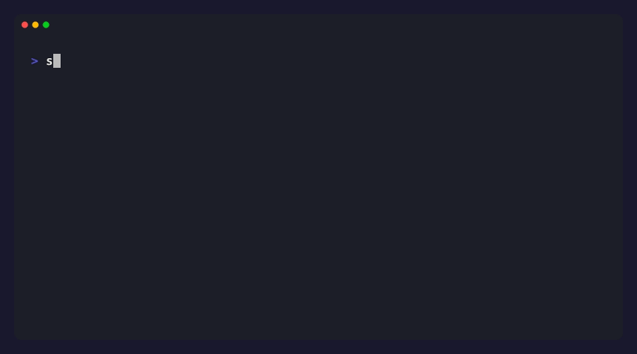
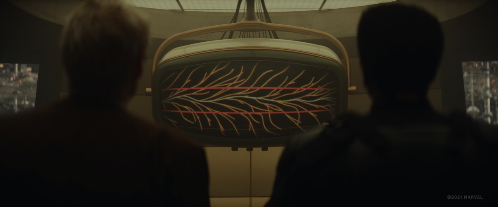

# Sacred Timeline

**Git for humans: Innovation architecture for the AI age**



---

## The Origin Story

Watching Marvel's **Loki**, we had a realization.

The TVA protects the Sacred Timeline — the one true, proven version of reality. Variants create branch timelines where they can explore dangerous, divergent possibilities. If a branch succeeds, it gets woven back in. If it fails, it gets pruned. No harm done to the Sacred Timeline.

**That's exactly how git works.**

We'd been using git for years without seeing it. The moment we did, the whole system clicked. Main branch = Sacred Timeline. Feature branches = alternate realities for safe experimentation. Git = the TVA. Commits = nexus events that freeze a moment in time.

The problem: git speaks in commands designed for engineers. But the *concepts* underneath — safe experimentation, protected history, mergeable parallel realities — belong to everyone. Writers. Strategists. Researchers. Anyone building anything with AI.

So we built the human interface for it.

> *"Your world may seem singular to you, but really, it's a teeny, tiny, weenie speck on a vast cosmic canvas. In reality, the only universe considered the true universe exists on the Sacred Timeline, and it is guarded zealously by all of us here at the TVA."*
>
> —Mr. Paradox to Deadpool


*The Sacred Timeline from Marvel's Loki (©2021 Marvel). The red thread is your main branch — protected, proven, untouchable. The branches are your experiments.*

---

## The Idea

In Marvel's Loki, the **Sacred Timeline** is the main reality — protected and preserved. **Branch timelines** are alternate realities where you can explore different choices safely. The **TVA** manages it all.

Git works the same way. Your main branch is your Sacred Timeline. Feature branches are alternate realities for experimentation. Git is your TVA.

**Sacred Timeline brings this power to everyone** — not just coders.

| Marvel Concept | Git Concept | What It Means |
|----------------|-------------|---------------|
| Sacred Timeline | main branch | Your working, proven version |
| Branch Timeline | feature branch | Safe space to experiment |
| TVA | Git system | Manages all your timelines |
| Nexus Event | commit | A captured decision point |
| Timeline Merge | git merge | Bring successful experiments back |
| Pruning | branch delete | Remove failed experiments |

**The superpower:** Try bold ideas without fear. If the experiment fails, your Sacred Timeline is untouched. If it succeeds, merge it in.

---

## The Problem

Everyone creates the same mess:
- `Strategy-Doc_v1.docx`
- `Strategy-Doc_v2_final.docx`
- `Strategy-Doc_v2_final_FINAL.docx`

Which one is current? What changed? Where did that idea go?

## The Solution

Git assumes work is not linear. Multiple experiments happen simultaneously. Some fail, some succeed. Sacred Timeline brings this power to everyone.

## The Language

| What you mean | Sacred Timeline | What Git calls it |
|---------------|-----------------|-------------------|
| Save this moment | `capture` | git commit |
| Summarize my progress | `narrate` | git log (analyzed) |
| Get latest from cloud | `latest` | git pull |
| Send to cloud | `backup` | git push |
| What did I change? | `changes` | git diff/status |
| Show me history | `timeline` | git log |
| Try something risky | `experiment` | git branch |
| Keep the experiment | `keep` | git merge |
| Abandon experiment | `discard` | git branch -d |
| Go back to earlier | `restore` | git checkout |
| Start fresh | `start` | git init |
| Connect to cloud | `connect` | git remote add |
| Something's tangled | `untangle` | merge conflict |

## Features

### Visual Sidebar
- One-click capture, latest, backup
- See changes at a glance
- Browse your timeline visually
- Experiment status always visible

### Command Palette
All commands available via `Cmd+Shift+P`:
- "Sacred Timeline: Capture"
- "Sacred Timeline: Latest"
- "Sacred Timeline: Backup"
- etc.

### Keyboard Shortcuts
- `Cmd+Shift+S` - Capture (save this moment)
- `Cmd+Shift+L` - Latest (get from cloud)
- `Cmd+Shift+B` - Backup (send to cloud)

### Status Bar
Always shows:
- Current branch/experiment
- Unsaved changes indicator
- Sync status with cloud

## Installation

### Not sure where to start?

**[suhitanantula.github.io/sacred-timeline](https://suhitanantula.github.io/sacred-timeline)** — copy a prompt, paste it into Claude, and Claude walks you through the whole setup. No technical knowledge needed.

---

### One-line install (CLI + Claude Code skill)
```bash
curl -fsSL https://raw.githubusercontent.com/suhitanantula/sacred-timeline/main/install.sh | bash
```

This installs the `sacred` CLI globally and, if Claude Code is detected, installs the Sacred Timeline skill so you can use `/sacred-timeline` in any session.

### CLI only
```bash
npm install -g @suhit/sacred-timeline
```

Then use anywhere:
```bash
sacred capture "Added new feature"
sacred latest
sacred backup
sacred timeline
```

### Claude Code Skill
Once installed, open any project in Claude Code and type:
```
/sacred-timeline
```
Claude will check your status, speak in sacred language, and narrate your work in plain English — no API key required.

### VS Code Extension
1. Open VS Code
2. Go to Extensions (Cmd+Shift+X)
3. Search for "Sacred Timeline"
4. Click Install

## Quick Start

### For a new project:
1. Open your folder in VS Code
2. Click "Start Timeline" in the sidebar
3. Make some changes
4. Click "Capture" and describe what you did
5. Click "Connect" to link to GitHub
6. Click "Backup" to save to cloud

### Daily workflow:
1. Open VS Code
2. Click "Latest" to get any changes
3. Do your work
4. Click "Capture" when you reach a milestone
5. Click "Backup" when done for the day

### Trying something risky:
1. Click "Experiment" and name it
2. Make your changes freely
3. If it works: Click "Keep"
4. If it doesn't: Click "Discard"

## Philosophy

This project is built on the idea that Git is **innovation architecture**, not just version control.

- **Capture** = "I tried something and here's what I learned"
- **Backup** = "Sharing my learning into the collective universe"
- **Latest** = "Bringing the latest collective thinking into my work"
- **Experiment** = "Starting a safe space to try something risky"
- **Keep** = "This experiment succeeded, make it the new normal"

## Who This Is For

- **Vibe coders** — using Claude Code, Cursor, or OpenClaw to build without knowing git exists
- **AI tool users** — wanting to understand what the AI changed and roll back safely
- **Developers** — wanting a human-readable layer on top of full git power
- **Writers** managing book manuscripts, articles, or long-form research
- **Consultants and strategists** building frameworks, decks, and plans iteratively
- **Researchers** tracking ideas, experiments, and findings
- **Anyone** tired of `_v2_final_FINAL.docx`

## Development

```bash
# Clone the repo
git clone https://github.com/suhitanantula/sacred-timeline.git

# Install dependencies
npm install

# Compile
npm run compile

# Run in VS Code
Press F5 to launch Extension Development Host
```

## Related

- [Sacred Timeline for Obsidian](https://github.com/suhitanantula/sacred-timeline-obsidian) - Plugin for Obsidian vaults

## Credits

Built by [Suhit Anantula](https://suhitanantula.com) as part of the Co-Intelligent Organisation project.

The language design was inspired by the insight that top-level coders, strategists, and knowledge workers will all work the same way in the AI age.

## License

MIT
